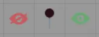
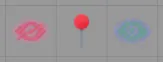
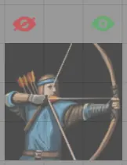
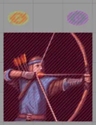

# Interface Chaosium Canvas

O FoundryVTT v12 implementou [fa-regular fa-game-board]Regioes de Cena, que permitem acionar [fa-solid fa-child-reaching]Comportamentos com base em interacoes de tokens.

A Base de Conhecimento do FoundryVTT possui informacoes sobre o uso de [Desenhos](https://foundryvtt.com/article/drawings/), [Notas de Mapa](https://foundryvtt.com/article/map-notes/), [Regioes de Cena](https://foundryvtt.com/article/scene-regions/) e [Tiles](https://foundryvtt.com/article/tiles/). Recomenda-se ter uma compreensao basica de cada um antes de continuar.

## Comportamentos adicionais de Regiao de Cena
Clickable Events amplia isso para permitir que interacoes de mouse executem macros. A Interface Chaosium Canvas e uma versao simplificada que facilita adicionar esse tipo de interacao as suas proprias cenas.

Voce pode obter o UUID de Desenhos, Luzes, Notas de Mapa, Regioes de Cena e Tiles clicando no botao [fa-solid fa-passport]Copiar UUID do Documento no cabecalho.

Se estiver usando FoundryVTT v14, a aba [fa-solid fa-puzzle-piece]Placeables permite arrastar e soltar Desenhos, Notas de Mapa, Regioes de Cena e Tiles em vez de copiar o UUID.

Se estiver usando FoundryVTT v13, voce pode arrastar Regioes de Cena e Comportamentos de Regiao para a aba [fa-solid fa-child-reaching]Comportamentos para duplica-los em sua nova Regiao de Cena.

## CCI: Alternar Desenho
Pode ser usado como CCI Alternar Tile (abaixo) para mostrar e ocultar um Desenho. Exige duas regioes, uma para mostrar e outra para ocultar. So pode ser acionado pelo GM (Guardiao).

- **Botao do Mouse** - Deve acionar com botao esquerdo, direito ou ambos
- **Acao** - Define se clicar nesta regiao mostrara, ocultara ou alternara os Desenhos, Entradas de Diario e Paginas de Diario relevantes. Tambem pode ser usado para habilitar ou desabilitar outros Comportamentos de Regiao
- **Selecionar Desenho** - Insira o UUID do Desenho e pressione o botao Adicionar Documento
- **Selecionar Entradas de Diario** - Insira o UUID como em Selecionar Desenho ou arraste aqui
- **Permissao para Documentos** - Se Mostrar estiver marcado, os Documentos terao esta permissao padrao
- **Permissao ao ocultar Entradas de Diario** - Se Mostrar nao estiver marcado, os Documentos terao esta permissao padrao
- **Selecionar Paginas de Entrada de Diario** - Insira o UUID como em Selecionar Desenho ou arraste aqui
- **Permissao para Paginas de Entrada de Diario** - Se Mostrar estiver marcado, as Paginas de Diario terao esta permissao padrao
- **Permissao ao ocultar Paginas de Diario** - Se Mostrar nao estiver marcado, as Paginas de Diario terao esta permissao padrao
- **Selecionar Comportamento de Regiao** - Insira o UUID como em Selecionar Desenho para habilitar (Mostrar marcado) ou desabilitar (Mostrar desmarcado)
- **Botao Acionar Regiao** - Se Botao do Mouse for Ambos, e este botao for usado, aciona a regiao seguinte
- **Acionar Esta Regiao** - Insira o UUID como em Selecionar Desenho
- **Com Clique de Botao** - Aciona um clique esquerdo ou direito na Regiao acima

## CCI: Alternar Luz
Projetado para alternar varias fontes de luz ao mesmo tempo. So pode ser acionado pelo GM (Guardiao).

- **Botao do Mouse** - Deve acionar com botao esquerdo ou direito
- **Acao** - Define se clicar nesta regiao ligara, desligara ou alternara as luzes
- **Selecionar Fontes de Luz** - Insira o UUID da Luz e pressione o botao Adicionar Documento

## CCI: Alternar Nota de Mapa
Projetado para criar um alternador de visibilidade de Nota de Mapa para jogadores. Exige duas regioes, uma para mostrar a Nota de Mapa e outra para oculta-la. So pode ser acionado pelo GM (Guardiao).

- **Botao do Mouse** - Deve acionar com botao esquerdo ou direito
- **Acao** - Define se clicar nesta regiao mostrara, ocultara ou alternara a Nota de Mapa para os jogadores
- **Documentos Selecionados** - Estes documentos terao suas permissoes alteradas; deve ser a mesma Entrada de Diario ou Pagina de Diario da Nota de Mapa. Voce pode arrastar o Documento aqui ou adicionar o UUID pelo mesmo metodo das Notas de Cena
- **Notas de Cena** - Insira o UUID da Nota de Mapa e pressione o botao Adicionar Documento
- **Permissao de Mostrar** - Quando Mostrar estiver marcado e a Regiao de Cena for acionada, as permissoes padrao dos Documentos Selecionados serao definidas para isto
- **Permissao de Ocultar** - Quando Mostrar nao estiver marcado e a Regiao de Cena for acionada, as permissoes padrao dos Documentos Selecionados serao definidas para isto

*Exemplo*

Usando uma Nota de Mapa, dois Tiles e duas Regioes de Cena

As imagens dos tiles estao disponiveis nestes caminhos: systems/CoC7/assets/art/eye-red.svg e systems/CoC7/assets/art/eye-green.svg

Visualizando a camada de Regiao de Cena

## CCI: Abrir Documento
Projetado para abrir um Documento, por exemplo Entrada de Diario, Pagina de Diario ou Ator.

- **Botao do Mouse** - Deve acionar com botao esquerdo ou direito
- **Clicar Se** - Quem pode clicar nesta regiao
  - Sempre - Todos os usuarios
  - Pode Ver Documento - Apenas usuarios com permissao para visualizar o documento
  - Pode Ver Tile - Apenas usuarios com permissao para visualizar o documento e que possam ver o tile
  - Guardiao - Apenas usuarios GM (Guardioes)
- **Selecionar Documento** - Insira o UUID do Documento e pressione o botao Adicionar Documento
- **Ancora Opcional** - Se o Documento for uma Pagina de Diario, voce pode definir uma ancora opcionalmente

## CCI: Tocar Som
Projetado para tocar/parar um som ou playlist

- **Botao do Mouse** - Deve acionar com botao esquerdo ou direito
- **Acao** - Define se clicar nesta regiao tocara ou interrompera a reproducao
- **Selecionar Playlist** - Insira o UUID da Playlist e pressione o botao Adicionar Documento ou arraste aqui
- **Selecionar Som da Playlist** - Insira o UUID como em Selecionar Playlist ou arraste aqui

## CCI: Jogador
Arraste e solte Investigadores para preencher imagem, nome e ocupacao para acesso rapido a ficha

- **Botao do Mouse** - Deve limpar com botao esquerdo ou direito
- **Tile de Imagem do Investigador** - Qual tile contem a imagem
- **Imagem de marcador** - Quando o jogador for limpo, mostrar esta imagem
- **Desenho do Nome do Investigador** - Qual desenho contem o nome do Ator
- **Texto de marcador** - Quando o jogador for limpo, mostrar este nome de Ator
- **Desenho da Ocupacao do Investigador** - Qual desenho contem o nome da ocupacao
- **Texto de marcador** - Quando o jogador for limpo, mostrar este nome de ocupacao
- **Outra Regiao de Jogador** - Regiao em outras cenas para replicar acoes de arrastar e soltar ou limpar

## CCI: Alternar Tile
Projetado para ser usado com CCI Abrir Documento (acima) para mostrar e ocultar um Tile que possui uma Regiao de Cena CCI: Abrir Documento. Exige duas regioes, uma para mostrar e outra para ocultar. So pode ser acionado pelo GM (Guardiao).

- **Botao do Mouse** - Deve acionar com botao esquerdo, direito ou ambos
- **Acao** - Define se clicar nesta regiao mostrara, ocultara ou alternara os Tiles, Entradas de Diario e Paginas de Diario relevantes. Tambem pode ser usado para habilitar ou desabilitar outros Comportamentos de Regiao
- **Selecionar Tile** - Insira o UUID do Tile e pressione o botao Adicionar Documento
- **Selecionar Entradas de Diario** - Insira o UUID como em Selecionar Tile ou arraste aqui
- **Permissao para Documentos** - Se Mostrar estiver marcado, os Documentos terao esta permissao padrao
- **Permissao ao ocultar Entradas de Diario** - Se Mostrar nao estiver marcado, os Documentos terao esta permissao padrao
- **Selecionar Paginas de Entrada de Diario** - Insira o UUID como em Selecionar Tile ou arraste aqui
- **Permissao para Paginas de Entrada de Diario** - Se Mostrar estiver marcado, as Paginas de Diario terao esta permissao padrao
- **Permissao ao ocultar Paginas de Diario** - Se Mostrar nao estiver marcado, as Paginas de Diario terao esta permissao padrao
- **Selecionar Comportamento de Regiao** - Insira o UUID como em Selecionar Tile para habilitar (Mostrar marcado) ou desabilitar (Mostrar desmarcado)
- **Botao Acionar Regiao** - Se Botao do Mouse for Ambos, e este botao for usado, aciona a regiao seguinte
- **Acionar Esta Regiao** - Insira o UUID como em Selecionar Tile
- **Com Clique de Botao** - Aciona um clique esquerdo ou direito na Regiao acima

*Exemplo*

Usando tres Tiles e tres Regioes de Cena

As imagens dos tiles estao disponiveis nestes caminhos: systems/CoC7/assets/art/eye-red.svg e systems/CoC7/assets/art/eye-green.svg

Visualizando a camada de Regiao de Cena

## CCI: Para Cena
Projetado para mover entre Cenas

- **Botao do Mouse** - Deve acionar com botao esquerdo ou direito
- **Pode clicar se** - Quem pode clicar nesta regiao
  - Sempre - Todos os usuarios
  - Guardiao - Apenas usuarios GM (Guardioes)
  - Pode Ver Tile - Apenas usuarios que possam ver o tile
- **Selecionar Cena** - Insira o UUID da Cena e pressione o botao Adicionar Documento ou arraste aqui
- **Selecionar Tile** - Insira o UUID do Tile e pressione o botao Adicionar Documento
