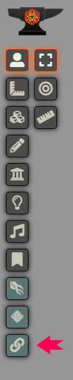
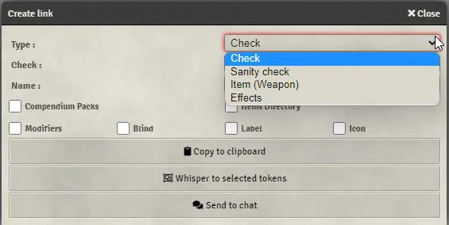
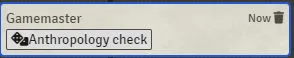
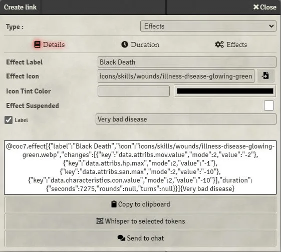
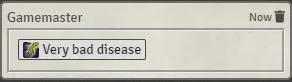
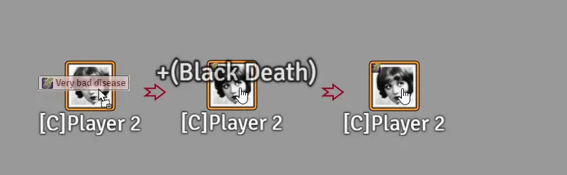

# Ferramenta de criacao de links

O sistema inclui uma ferramenta para ajudar a criar links com facilidade.
Ela fica na barra lateral esquerda. Clique no icone [fa-solid fa-link].
Esta ferramenta esta disponivel apenas para o GM.

Com ela voce pode criar [links](links.md) para testes de pericia, testes de SAN, efeitos e outras acoes.
Como alternativa, voce pode abrir a ferramenta segurando CTRL enquanto clica em um item ou pericia.

## Janela principal

Ao clicar no icone da ferramenta, uma janela sera aberta:

Nela voce pode selecionar as opcoes do link.

- "Pacotes de compendio" e "Diretorio de itens" permitem referenciar um objeto da pasta correspondente.
- "Modificadores" permite adicionar modificadores ao teste.
- "blind" forcara o modo de rolagem como rolagem cega.
- "Rotulo" permite alterar o texto exibido.
- "Icone" permite escolher um icone para o link. Icones podem ser:
  - Uma referencia Font Awesome ou game-icons: "fa-solid fa-ankh" ou "game-icon game-icon-tentacle-strike".
  - Um caminho para imagem nos dados do sistema ou no nucleo do sistema: "icons/magic/symbols/arrowhead-green.webp".

Se voce nao informar um rotulo e/ou icone, um rotulo e icone padrao serao adicionados.

## Janela de efeitos

Selecionar efeitos abrira uma janela avancada onde voce pode criar links para [efeitos ativos](effects.md).
Selecione as opcoes da mesma forma que faria para um efeito normal.

## Usando links

- Quando seu link estiver criado e valido, ele aparecera em uma caixa branca no meio da janela.

- Agora voce pode sussurra-lo para seus jogadores, copia-lo para a area de transferencia para adicionar a itens ou entradas de diario, ou envia-lo para o chat.

- Quando um jogador clica em um link, a acao correspondente e executada pelo personagem dele.
- Quando um GM clica em um link, a acao correspondente e executada pelos tokens selecionados.
- Um link pode ser arrastado e solto em entradas de diario, em um token etc.

