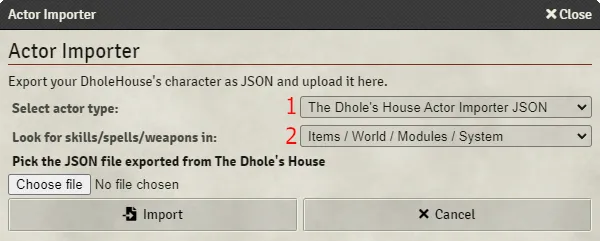

<!--- This file is auto generated from module/manual/de/actor_importer.md -->
# Spielfiguren Importer

Du kannst den Spielfiguren Importer verwenden, um verschiedene Formen von NSC- oder Kreaturenblöcke aus Abenteuern zu importieren. Ebenso kannst du Spielercharaktere importieren, die aus dem JSON Export-Tool von [The Dholes House](https://www.dholeshouse.org/) stammen.

Um den Spielfiguren-Importer zu öffnen, öffnen Sie entweder das Akteure-Verzeichnis und klicken Sie unten in der Seitenleiste auf Darsteller-Importer oder klicken Sie in einer aktiven Szene auf Darsteller-Importer

# Übersicht

Falls du diese Funktion das erste Mal verwendest, lese bitte auch die folgenden Abschnitte zur näheren Erklärung.

- Nichtspielercharakter (NSC) / Kreatur
- The Dhole's House Actor Importer JSON

# Nichtspielercharakter (NSC) / Kreatur

1. Wähle NSC oder Kreatur
2. Soll das System den Charakterblock einer früheren Edition in die 7. Edition konvertieren?
3. Wähle die Originalsprache des Charakterblocks
4. Beim Hinzufügen von Fertigkeiten, Gegenständen, Zaubersprüchen und Waffen, kann das System versuchen Items in Ihrer Welt mit demselben Namen zu finden. Sie können die Reihenfolge der Nachschlageorte, in welchen gesucht werden soll festlegen:

	_Gegenstände_: Aus Ihrem Itemverzeichnis

	_Welt_: Aus Ihren Kompendien dieser Welt

	_Module_: Aus Ihren Kompendien, welche durch Module hinzugefügt wurden

	_System_: Aus den Systemkompendien, welche vom System bereitgestellt werden

5. Ein Beispielentwurf ist hier aufgeführt, welches Sie in Ihre Zwischenablage kopieren können, wenn Sie es bearbeiten oder den Text aus einem Abenteuer einfügen möchten

Das Klicken auf "Import" wird eine Spielfigur im Ordner "importierte Charaktere" im Akteure-Verzeichnis erstellen. Jeglicher Text, der nicht verstanden wurde wird in den Spielleiternotizen festgehalten.

# The Dhole's House Actor Importer JSON

1. The Dhole's House Actor Importer JSON
2. Beim Hinzufügen von Fertigkeiten, Gegenständen, Zaubersprüchen und Waffen, kann das System versuchen Items in Ihrer Welt mit demselben Namen zu finden. Sie können die Reihenfolge der Nachschlageorte, in welchen gesucht werden soll festlegen:

	_Gegenstände_: Aus Ihrem Itemverzeichnis

	_Welt_: Aus Ihren Kompendien dieser Welt

	_Module_: Aus Ihren Kompendien, welche durch Module hinzugefügt wurden

	_System_: Aus den Systemkompendien, welche vom System bereitgestellt werden

Durchsuchen Sie Ihren Computer nach Ihrer JSON Datei. Sobald sie diese selektiert haben, wird der Name und das Bild angezeigt. Klicken Sie "Importieren", um die Spielfigur im Ordner "importierte Charaktere" im Akteure-Verzeichnis zu erstellen.

Standardmäßig wird das Bild in einem Ordner "dhole-images" in Ihrer Welt abgelegt. Dies können Sie ändern, indem Sie auf die Registerkarte Spieleinstellungen klicken, danach unter "Einstellungen anpassen" im Abschnitt "Call of Cthulhu 7th Edition" konfigurieren und den Ordnerpfad eintragen.
