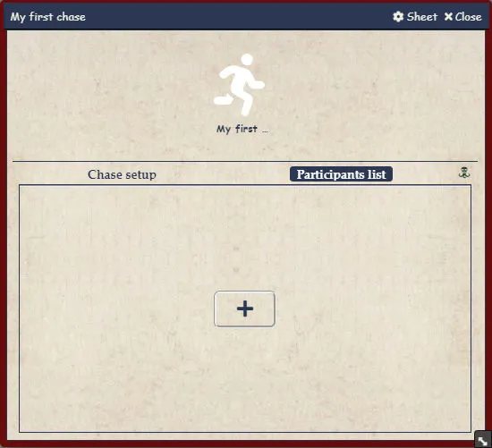
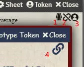
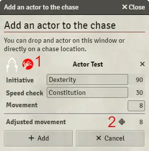
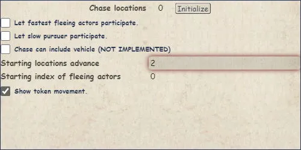
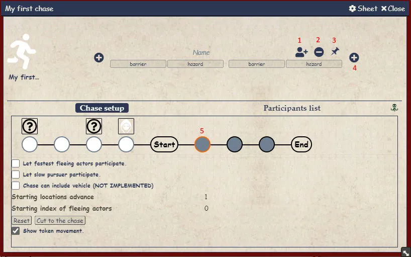
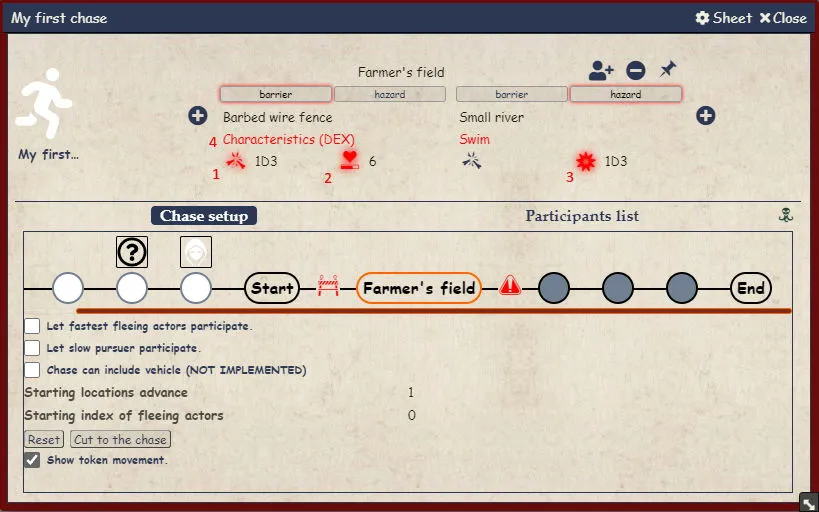
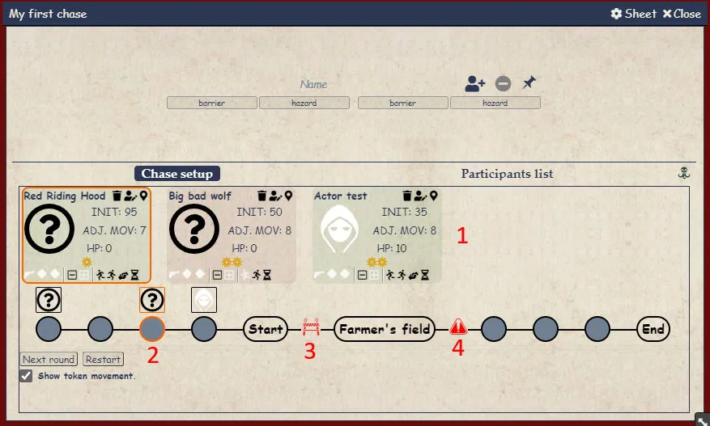
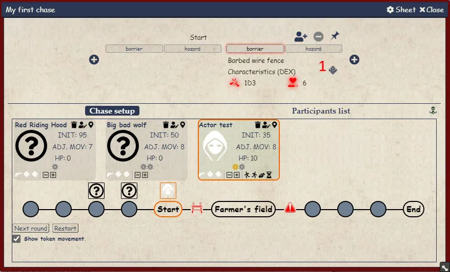
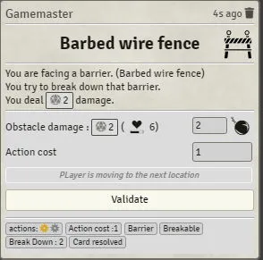
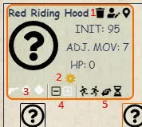

<!--- This file is auto generated from module/manual/de/chases.md -->
# Erstellen einer Neuen Verfolgungsjagd

Um eine neue Verfolgungsjagd zu initiieren, erstellen Sie ein Item vom Typ Verfolgungsjagd.

Nur der Spielleiter sollte Zugriff auf das Item haben.

Eine Verfolgungsjagd ist zusammengestellt aus einer Folge von Orten. Jeder Ort kann durch eine Hürde (Hindernis oder Gefahr) von einem anderen getrennt werden.

Eine Gefahr wird immer überwunden, eine nicht geschaffte Probe wird Sie jedoch ausbremsen.

Ein Hindernis wird Sie stoppen, bis Sie es erfolgreich überwinden, oder es zerstören.

Der Verfolgungsjagdbogen ist aufgeteilt in 3 Teile.

- In einer Kopfzeile werden Sie die Information des aktuellen Ortes sehen, sobald die Verfolgungsjagd gestartet ist.
- Ein Reiter Verfolgungsjagd einrichten. Dieser erlaubt es Ihnen die Erstellung und Verfolgung der Verfolgungsjagd.
- Eine Teilnehmerliste, in welcher Sie die Teilnehmenden hinzufügen können. Dieser Reiter wird nicht mehr funktionieren, sobald die Verfolgungsjagd gestartet ist.

# Einen Teilnehmer hinzufügen

Um einen Teilnehmer hinzuzufügen klicken Sie auf das Plus Zeichen der Teilnehmerliste oder Ziehen Sie einen Akteur bzw. einen Token darauf.

Beachten Sie, dass es nicht zwingend notwendig ist, einen Akteur mit einem Teilnehmer zu verbinden. Dies erlaubt es, eine Verfolgungsjagd schnell aufsetzen oder jemanden spontan hinzuzufügen.

Um in der Lage zu sein, einen Token zur Verfolgungsjagd hinzuzufügen wurden einige Bedienelemente dem Charakterbogen, sowie dem NSC-Bogen hinzugefügt:

Diese Icons geben zusätzliche Informationen.

1. Kennzeichnet, dass dieser Akteur ein synthetischer Akteur ist (Instanz eines Akteurs)
2. Kennzeichnet, dass die Akteurdaten nicht verknüpft sind. Jede Instanz des Akteurs hat seine eigenen Eigenschaften.
3. Kennzeichnet, dass dieser Akteur ein ensprechendes Token hat. **Sie können dieses auf die Verfolgung oder die Teilnehmerliste ziehen und ablegen**.
4. Kennzeichnet, dass die Akteurdaten verknüpft sind mit dem Akteur im Akteur-Verzeichnis.

Hier können Sie ihre Teilnehmer festlegen. Das Ziehen eines Charakters aus der Akteur Seitenleiste wird die Details festlegen. Beachten Sie, dass Sie eine abweichende Initiative und Geschweindigkeitsprüfung auswählen können. Dies ist nicht der Standard in CoC, aber erlaubt ein Setup ungewöhnlicher Verfolgungsjagden (futuristische Matrix Verfolgungsjagd, Traumlande Verfolgungsjagd, ...)

1. Wenn Sie das Fragezeichen auf den Token ziehen werden die Details dem Token zugeordnet.

Sobald Sie einen Akteur Ziehen oder ein Token auswählen können Sie den Teilnehmer einrichten.

1. Wenn Sie dies Klicken wird der Teilnehmer die Seite wechseln vom Gejagten zum Jäger.
2. Wenn Sie dies Klicken wird dies eine Geschwindigkeitsprobe auslösen. Beachten Sie, dass dabei weder Spielereinträge notwendig sind noch eine Würfelproben als Nachricht angezeigt wird.

# Teilnehmerliste

Hier können Sie die Liste der Teilnehmer an der Verfolgungsjagd einsehen.

1. Dies wird einen Verfolgungsprobe auslösen. Dies wird eine Würfelwurfnachricht erstellen, falls der Teilnehmer einen zugeordneten Akteur hat (und es kein `Dummy` ist). Das Halten der Umschalttaste wird das Modifikationsfenster überspringen und den Wurf ausführen.
2. Dies wird die Geschwindigkeitsprobe leeren, falls einer existiert, oder den Teilnehmer löschen.

1. Probennachricht wartet im Nachrichtenbereich ausgeführt zu werden.
2. Geschwindigkeitsprobe wird gewürfelt. Sie können für mehr diese Anklicken für mehr Details.
3. Die Geschwindigkeitsprobe zurücksetzten.

# Verfolgungsjagd Setup

Um eine Verfolgungsjagd aufzusetzen geben Sie die Anzahl der Orte ein und klicken Sie auf initialisieren.

Die Verfolgungsjagd ist initialisiert, nun können Sie einige Optionen anpassen. Orte in weiß sind initiale Orte und können nicht modifiziert werden.

1. Dies ist die Übersicht der Verfolgungsjagd, weiße Orte sind initiale Orte. Die grauen Orte sind die aktiven Verfolgungsjagdorte.
2. Durch diese Auswahl werden die Teilnehmer berücksichtigt, welchen es sonst möglich wäre zu entkommen.
3. Durch diese Auswahl werden die Teilnehmer berücksichtigt, welche ausgeschlossen worden wären, weil sie zu langsam waren.
4. Dies ist die Anzahl der Orte zwischen dem langsamsten Gejagten und dem schnellsten Verfolger.
5. Dies ist der Startpunkt des schnellsten Gejagten. Wenn Sie dies auf 0 festlegen, wird das den Gejagten kurz vor dem Startpunkt platzieren. 1, wird ihn auf dem Startpunkt platzieren. -1, wird ihn 1en Ort for dem Start platzieren.
6. Dies wird die Token animieren bei der Bewegung zu einem neuen Ort.

# Das Aufsetzten von Orten

Während des Aufsetzens oder der Jagd können sie Orte auswählen um diese zu modifizieren.

(Weiße) Startpunkte können während des Aufsetzens nicht modifiziert werden.

Um einen Ort zu modifizieren, wählen sie diesen durch Klicken darauf aus. Dies wird die Einzelheiten des Ortes im Kopfbereich des Bogens darstellen.

1. Dies wird einen Teilnehmer hinzufügen. Falls die Verfolgungsjagd gestartet wird, wird sich der Teilnehmer auf dieser Position befinden. Falls die Verfolgungsjagd nicht gestartet ist, wird der Teilnehmer auf der Einstiegsposition hinzugefügt.
2. Dies wird den Ort entfernen. Ein Ort muss leer sein, dass er gelöscht werden kann.
3. Sie können dies auf eine Szene ziehen und ablegen. Dies wird die Koordinaten des Ortes definieren. Eine rote Stecknadel zeigt an, dass die Koordinaten gesetzt wurden. Ein Rechtsklick auf eine rote Stecknadel wird dessen Koordinaten zurücksetzten. Falls Koordinaten gesetzt wurden und ein Teilnehmer mit einem entsprechenden Token den Ort betritt, wird sein Token auf den Ort bewegt.
4. Fügen Sie einen neuen Ort hinzu.
5. Aktivieren Sie den Ort.

# Das Aufsetzen von Hindernissen

Sie können Hindernisse vor und nach einem Ort hinzufügen. Sie können ein Hindernis vorab mit einem Namen, einer entsprechenden Probe und einigen Nachteilen befüllen.

1. Schalten Sie dies um, um einem Hindernis Schaden zuzufügen.
2. Die Trefferpunkte des Hindernisses
3. Die Bewegungskosten im Falle eines Fehlschlags
4. Die Probe, die notwendig ist das Hindernis zu überwinden. Falls es rot ist, hat der aktive Akteur keine solche entsprechende Probe.

# Zur Sache kommen

Wenn Sie bereit sind, können Sie zum Sache kommen. Falls nicht alle Teilnehmer eine Geschwindigkeitsprobe durchgeführt haben wird dies eine Warnung erzeugen und Sie nicht starten lassen.

1. Aktionsschiene. Der aktive Teilnehmer orange umkreist.
2. Verfolgungsjagd. Aktiver Ort und Teilnehmer. Sie können Teilnehmer ziehen und ablegen von der Verfolgungsjagd um diese frei zu bewegen. Sie können einen neuen Akteur oder Token direkt in die Verfolgungsjagd ziehen. Dies wird ein Importfenster öffnen und den Teilnehmer zur Verfolgungsjagd hinzufügen. In einigen Fällen (z. B. wenn ein neuer Gejagter langsamer ist als der langsamste Teilnehmer) werden alle Bewegungsaktionen neu berechnet.
3. Ein Hindernis
4. Eine Gefahr

# Ablauf des Überwindens des Hindernisses

1. Wenn der aktive Teilnehmer auf ein Hindernis trifft, können Sie den Ablauf des Überwindens des Hindernisses auslösen, wenn Sie dies Klicken. Es wird eine Nachricht erstellen, mit welcher Spielleiter und Spieler interagieren können um das Hindernis zu überwinden. Alle Änderungen an der Chatnachricht können auf das Hindernis der Verfolgungsjagd zurückgeworfen werden am Ende des Ablaufes.

Im Folgenden ein kurzes Ablaufbeispiel:

Wenn der Ablauf komplettiert ist, werden alle Änderungen an die Verfolgungsjagd gesendet.

Die Runde ist abgeschlossen. Alle Charaktere haben ihre Bewegungsaktionen aufgebraucht. Sie können nächste Runde anklicken, um weiterzumachen.

# Teilnehmersteuerung

Sie können einen Teilnehmer modifizieren oder bewegen durch das Verwenden der Steuerungsknöpfe auf der Karte.

1. Diese 3 Icons erlauben es den Teilnehmer zu löschen, modifizieren und zu aktivieren.
2. Bewegungsaktion. Gelb ist verfügbar, Grau ist verbraucht, rot ist ein Defizit.
3. Dies kontrolliert den Bonus Ihres Teilnehmers. Er kann eine Waffe ziehen oder einen Bonuswürfel gewähren.
4. Bewegungsaktionssteuerung. Hier können Sie die Bewegungsaktionen erhöhen oder verringern.
5. Bewegungssteuerung. Sie können sich rückwärts oder vorwärts bewegen. Sie können einen Verbündeten unterstützen (verbrauchen Sie dazu eine Aktion und gewähren Sie einen Bonuswürfel) oder gehen Sie behutsam vor.
