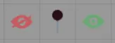
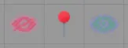

<!--- DO NOT EDIT. This file is automatically generated from module/manual/en/cci.md changes made to this file will be lost -->
# Chaosium Canvas Interface

FoundryVTT v12 implemented Scene Regions which allows you to trigger Behaviors based on token interactions.

The FoundryVTT Knowledge Base has information on using [Drawings](https://foundryvtt.com/article/drawings/), [Map Notes](https://foundryvtt.com/article/map-notes/), [Scene Regions](https://foundryvtt.com/article/scene-regions/), and [Tiles](https://foundryvtt.com/article/tiles/) it is recommend you have a basic understanding of each before continuing.

## Additional Scene Region Behaviors
Clickable Events extends this to allow mouse interactions to run macros, Chaosium Canvas Interface is a simplified version that makes it easier to add to your own scenes.

You can get the UUID for Drawing, Map Notes, Scene Regions, and Tiles by clicking the Copy Document UUID button in the header.

If you are using FoundryVTT v13 you can drag Scene Regions and Region Behaviors onto the Behaviors tab to duplicate them into your new Scene Region

## CCI: Drawing Toggle
This can be used like CCI Tile Toggle (below) to show and hide a Drawing. It requires two regions, one to show and the other to hide. This can only be triggered by the GM (Keeper).

- **Mouse Button** - Should this trigger on Left, Right or Both mouse buttons
- **Show** - Define if clicking on this region will show or hide the relevant Drawings, Journal Entries, and Journal Entry Pages. It can also be used to enable or disable other Region Behaviors
- **Select Drawing** - Enter the UUID of the Drawing and then press the Add Document button
- **Select Journal Entries** - Enter the UUID as per Select Drawing or Drag it here
- **Permission for Documents** - If Show is ticked the Documents will have this default permission
- **Hide Permission for Journal Entries** - If Show is unticked the Documents will have this default permission
- **Select Journal Entry Pages** - Enter the UUID as per Select Drawing or Drag it here
- **Permission for Journal Entry Pages** - If Show is ticked the Journal Entry Pages will have this default permission
- **Hide Permission for Journal Entry Pages** - If Show is unticked the Journal Entry Pages will have this default permission
- **Select Region Behavior** - Enter the UUID as per Select Drawing to enable (Show ticked) or disable (Show unticked)
- **Trigger Region Button** - If Mouse Button is Both, and this button is used trigger the following region
- **Trigger This Region** - Enter the UUID as per Select Drawing
- **With A Button Click** - Trigger a Left of Right click on the above Region

## CCI: Map Note Toggle
This is designed to make a toggle for player Map Note visibility and requires two regions, one to show the Map Note and one to hide it. This can only be triggered by the GM (Keeper).

- **Mouse Button** - Should this trigger on Left, Right or Both mouse buttons
- **Show** - Define if clicking on this region will show or hide the Map Note to the players
- **Selected Documents** - These documents will have their permissions altered, this should be set the same Journal Entry or Journal Entry Page as the Map Note. You can drag the Document here or add the UUID using the same method as Scene Notes
- **Scene Notes** - Enter the UUID of the Map Note and then press the Add Document button
- **Show Permission** - When Show is ticked and the Scene Region is triggered the default permissions for Selected Documents will be set to this
- **Hide Permission** - When Show is unticked and the Scene Region is triggered the default permissions for Selected Documents will be set to this

*Example*

Using a Map Note, two Tiles, and two Scene Regions

The tile images are available on these paths systems/CoC7/assets/art/eye-red.svg and systems/CoC7/assets/art/eye-green.svg

Viewing the Scene Region layer

## CCI: Open Document
This is designed to open a Document (e.g. Journal Entry, Journal Entry Page, or Actor).

- **Mouse Button** - Should this trigger on Left, Right or Both mouse buttons
- **Click If** - Who can click on this region
  - Always - All users
  - Can See Document - Only users that have permission to view the document
  - Keeper - Only GM users (Keepers)
- **Select Document** - Enter the UUID of the Document and then press the Add Document button
- **Optional Anchor** - If the Document is a Journal Entry Page you can optionally set the anchor

## CCI: Play Sound
This is designed to play/stop a sound or playlist

- **Mouse Button** - Should this trigger on Left, Right or Both mouse buttons
- **Play** - Define if clicking on this region will play or stop the playback
- **Select Playlist** - Enter the UUID of the Playlist and then press the Add Document button or Drag it here
- **Select Playlist Sound** - Enter the UUID as per Select Playlist or Drag it here

## CCI: Tile Toggle
This is designed to be used with CCI Open Document (above) to show and hide a Tile, which has an CCI: Open Document Scene Region. It requires two regions, one to show and the other to hide. This can only be triggered by the GM (Keeper).

- **Mouse Button** - Should this trigger on Left, Right or Both mouse buttons
- **Show** - Define if clicking on this region will show or hide the relevant Tiles, Journal Entries, and Journal Entry Pages. It can also be used to enable or disable other Region Behaviors
- **Select Tile** - Enter the UUID of the Tile and then press the Add Document button
- **Select Journal Entries** - Enter the UUID as per Select Tile or Drag it here
- **Permission for Documents** - If Show is ticked the Documents will have this default permission
- **Hide Permission for Journal Entries** - If Show is unticked the Documents will have this default permission
- **Select Journal Entry Pages** - Enter the UUID as per Select Tile or Drag it here
- **Permission for Journal Entry Pages** - If Show is ticked the Journal Entry Pages will have this default permission
- **Hide Permission for Journal Entry Pages** - If Show is unticked the Journal Entry Pages will have this default permission
- **Select Region Behavior** - Enter the UUID as per Select Tile to enable (Show ticked) or disable (Show unticked)
- **Trigger Region Button** - If Mouse Button is Both, and this button is used trigger the following region
- **Trigger This Region** - Enter the UUID as per Select Tile
- **With A Button Click** - Trigger a Left of Right click on the above Region

*Example*

Using a three Tiles and three Scene Regions

The tile images are available on these paths systems/CoC7/assets/art/eye-red.svg and systems/CoC7/assets/art/eye-green.svg

Viewing the Scene Region layer

## CCI: To Scene
This is designed to move between Scenes

- **Mouse Button** - Should this trigger on Left, Right or Both mouse buttons
- **Can click if** - Who can click on this region
  - Always - All users
  - Keeper - Only GM users (Keepers)
  - Can See Tile - Only users that have permission to view the Tile
- **Select Scene** - Enter the UUID of the Scene and then press the Add Document button or Drag it here
- **Select Tile** - Enter the UUID of the Tile and then press the Add Document button
