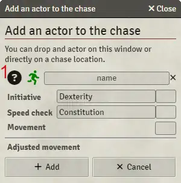
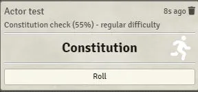

<!--- DO NOT EDIT. This file is automatically generated from module/manual/es/persecuciones.md changes made to this file will be lost -->
# Persecuciones

## Crear una nueva persecución

Para crear una persecución, crea un nuevo objeto de tipo persecución.

Solo el Guardián debería tener acceso a ese objeto.

Una persecución está compuesta por una sucesión de ubicaciones. Cada ubicación puede estar separada por un obstáculo (barrera o peligro).

Un peligro siempre se atravesará, pero fallar la tirada te ralentizará.

Una barrera te detendrá hasta que la superes o la destruyas.

La hoja de persecución está dividida en 3 partes.

- Un encabezado donde verás información sobre la ubicación actual una vez que comienza una persecución.
- Una pestaña de configuración de persecución. Esto te permitirá crear y seguir la persecución.
- Una lista de participantes donde puedes configurar a tus participantes. Esta pestaña no funcionará después de que comience la persecución.

## Agregar un participante.

Para agregar un participante, haz clic en el signo más (+) en la lista de participantes o arrastra un actor o una ficha.

Ten en cuenta que no es obligatorio tener un actor asociado con un participante. Esto permite una configuración rápida o agregar a alguien sobre la marcha a la persecución.

Para poder agregar una ficha a la persecución, se han agregado algunos controles a las hojas de personajes y PNJ:

Esos íconos proporcionarán información adicional.

1. Indica que este actor es un actor sintético (instancia de un actor).
2. Indica que los datos del actor no están vinculados. Cada instancia de ese actor tiene sus propias propiedades.
3. Indica que este actor tiene una ficha asociada. **Puedes arrastrar y soltar esto en una ubicación de persecución o en la lista de participantes**.
4. Indica que los datos del actor están vinculados a un actor en el directorio de actores.

Aquí puedes configurar a tu participante. Arrastrar un actor desde la barra lateral de Actores establecerá los detalles. Ten en cuenta que puedes seleccionar una iniciativa y una tirada de velocidad diferentes. Esto no es estándar en CoC, pero permite configurar persecuciones inusuales (persecución futurista en la matriz, persecución en las Tierras del Sueño...).

1. Arrastrar el signo de interrogación sobre una ficha establecerá los detalles en esa ficha.

Una vez que arrastras un actor o seleccionas una ficha, puedes configurar al participante.

1. Hacer clic en esto cambiará el lado del participante de presa a perseguidor.
2. Hacer clic en esto desencadenará una tirada de velocidad. Ten en cuenta que no se necesitarán entradas de jugador ni se mostrará ninguna carta de tirada.

## Lista de participantes

Aquí puedes ver la lista de participantes en la persecución.

1. Desencadenará una tirada de persecución. Esto creará una carta de tirada si el participante tiene un actor asociado (no es un falso). Mantener presionada la tecla Shift avanzará rápidamente y resolverá la carta.
2. Esto eliminará la tirada de velocidad si la hay, o eliminará al participante.

1. Carta de tirada esperando ser resuelta en el chat.
2. Tirada de velocidad realizada. Puedes hacer clic en esto para ver los detalles.
3. Para restablecer la tirada de velocidad.

## Configuración de persecución

Para configurar una persecución, ingresa los números iniciales de ubicaciones y haz clic en Inicializar.

La persecución está inicializada, puedes ajustar algunas opciones. Las ubicaciones en blanco son ubicaciones iniciales y no se pueden modificar.

1. Esta es la pista de persecución, las ubicaciones en blanco son ubicaciones iniciales. Las ubicaciones en gris son ubicaciones reales de persecución.
2. Seleccionar esto incluirá en la persecución a participantes que de otra manera habrían podido escapar.
3. Seleccionar esto incluirá en la persecución a participantes que habrían sido excluidos por ser demasiado lentos.
4. Este es el número de ubicaciones entre la presa más lenta y el perseguidor más rápido.
5. Esta es la ubicación inicial de la presa más rápida. Establecer esto en 0 la colocará justo antes del inicio. 1 la colocará en el inicio. -1 la colocará 1 ubicación antes del inicio.
6. Esto animará la ficha cuando se mueva a una nueva ubicación.

## Configuración de ubicaciones

Durante la configuración o durante la persecución, puedes seleccionar una ubicación para modificarla.

Las ubicaciones de inicio (blancas) no se pueden modificar durante la configuración.

Para modificar una ubicación, selecciónala haciendo clic en ella. Esto mostrará los detalles de la ubicación en la parte del encabezado de la hoja.

1. Esto agregará un participante. Si la persecución ha comenzado, el participante estará en esa ubicación. Si la persecución no ha comenzado, el participante se agregará en la pista de inicio.
2. Esto eliminará la ubicación. Una ubicación debe estar vacía para ser eliminada.
3. Puedes arrastrar esto y soltarlo en una escena. Esto establecerá las coordenadas para esa ubicación. Un pin rojo indica que las coordenadas se han establecido. Hacer clic con el botón derecho en un pin rojo restablecerá sus coordenadas. Si las coordenadas están establecidas y un participante con una ficha asociada entra en esa ubicación, su ficha se moverá a esa ubicación.
4. Agregar una nueva ubicación.
5. Ubicación activa.

## Configuración de obstáculos.

Puedes agregar obstáculos antes y después de una ubicación. Puedes prellenar un obstáculo con un nombre, una tirada asociada y algunas penalizaciones.

1. Alterna esto para agregar daño a una barrera.
2. Puntos de vida de la barrera.
3. Costo de acción de movimiento en caso de fallo.
4. Tirada utilizada para pasar la ubicación. Cuando está en rojo, el actor activo no tiene la tirada asociada.

## Ir directo a la persecución.

Cuando estés listo, puedes ir directo a la persecución. Si no todos los participantes tienen una tirada de velocidad, esto desencadenará una advertencia y no te dejará comenzar.

1. Pista de iniciativa. El participante activo está rodeado en naranja.
2. Pista de persecución. Ubicación y participante activos. Puedes arrastrar y soltar participantes desde la pista de persecución para moverlos libremente. Puedes arrastrar un nuevo actor o ficha directamente a la pista de persecución. Esto abrirá la ventana de importación y agregará ese participante a la persecución. En algunos casos (por ejemplo, nueva presa más lenta que el participante más lento) todas las acciones de movimiento se recalcularán.
3. Una barrera.
4. Un peligro.

## Flujo de resolución de obstáculos

1. Cuando el participante activo enfrenta un obstáculo, puedes desencadenar el flujo de resolución de obstáculos haciendo clic en esto. Esto abrirá una carta en el chat donde el Guardián y el jugador pueden interactuar para pasar ese obstáculo. Todos los cambios realizados en la carta pueden reflejarse en el obstáculo en la persecución al final del flujo.

Aquí tienes un ejemplo de flujo resumido:

Una vez que el flujo está completo, todos los cambios se envían a la persecución.

Esta ronda está terminada. Todos los actores han gastado sus acciones de movimiento. Puedes hacer clic en Siguiente ronda para proceder.

## Controles de participantes.

Puedes modificar o mover a un participante usando el botón de controles en su carta.

1. Estos 3 íconos permitirán eliminar, modificar y activar a un participante.
2. Acción de movimiento. Un amarillo está disponible, el gris se consume, el rojo es un déficit.
3. Esto controlará el bono de tu participante. Puede sacar una pistola o recibir dados de bonificación.
4. Controles de acción de movimiento. Aquí puedes aumentar o disminuir las acciones de movimiento.
5. Controles de movimiento. Puedes moverte hacia atrás o hacia adelante. Puedes ayudar a un aliado (consumir una acción y dar un dado de bonificación) o tomar un enfoque cauteloso.
