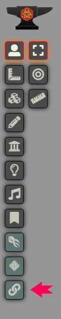
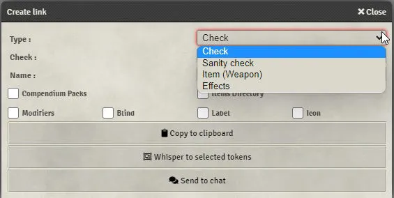
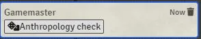
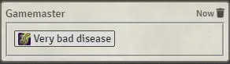
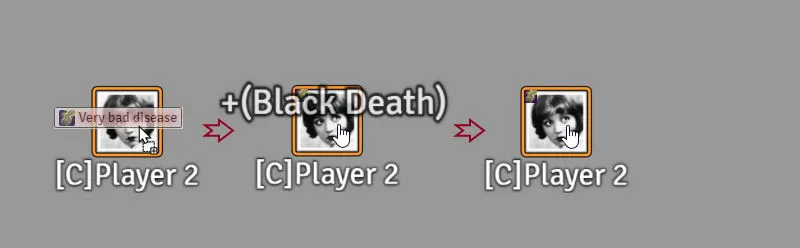

<!--- DO NOT EDIT. This file is automatically generated from module/manual/es/ventana_de_creacion_de_enlaces.md changes made to this file will be lost -->
# Herramienta de creación de enlaces

El sistema incluye una herramienta para ayudarte a crear enlaces fácilmente.
Está ubicada en la barra lateral izquierda. Haz clic en el icono .
Esta herramienta está disponible solo para el Guardián (GM).

Usando esto, puedes crear [enlaces](enlaces.md) para tiradas de habilidades, tiradas de cordura, efectos, etc.
Alternativamente, puedes abrir la herramienta manteniendo presionada la tecla CTRL mientras haces clic en un objeto o una habilidad.

## Ventana principal

Hacer clic en el icono de la herramienta abrirá una ventana:

Aquí puedes seleccionar opciones para tu enlace.

- "Paquetes de compendios" y "Directorio de objetos" te permiten hacer referencia a un objeto desde la carpeta correspondiente.
- "Modificadores" te permite agregar modificadores a tu tirada.
- "Ciego" forzará que el modo de tirada sea ciego.
- "Etiqueta" te permite cambiar la etiqueta de visualización.
- "Icono" te permite elegir un icono para tu enlace. Los iconos pueden ser:
  - Una referencia a Font Awesome o a game-icons: "fas fa-ankh" o "game-icon game-icon-tentacle-strike".
  - Un enlace a una imagen en los datos del sistema o en el núcleo del sistema: "icons/magic/symbols/arrowhead-green.webp".

Si no proporcionas una etiqueta y/o un icono, se agregará una etiqueta e icono predeterminados.

## Ventana de efectos

Seleccionar efectos abrirá una ventana avanzada donde puedes crear enlaces para [efectos activos](efectos.md).
Selecciona las opciones de la misma manera que lo harías para un efecto regular.

## Uso de enlaces

- Una vez que tu enlace está creado y es válido, aparecerá en un cuadro blanco en el centro de la ventana.

- Ahora estás listo para susurrárselo a tus jugadores, copiarlo en tu portapapeles para agregarlo a tus objetos o entradas de diario o enviarlo al chat.

- Cuando un jugador hace clic en un enlace, la acción correspondiente se realizará con su personaje.
- Cuando un Guardián (GM) hace clic en un enlace, la acción correspondiente se realizará con sus tokens seleccionados.
- Un enlace se puede arrastrar y soltar en entradas de diario, en un token, etc.

