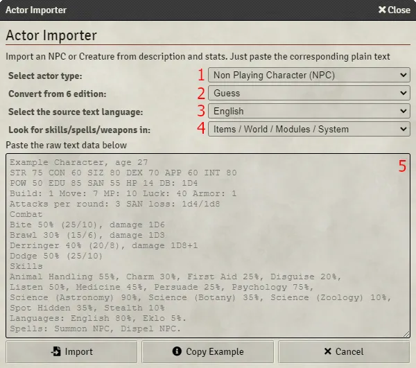
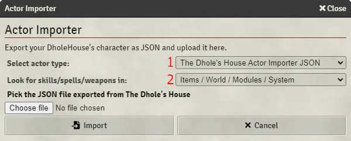

<!--- DO NOT EDIT. This file is automatically generated from coc7/manual/pt-BR/actor_importer.md changes made to this file will be lost -->
# Importador de Atores

Voce pode usar o importador de atores para importar blocos de varios NPCs/Criaturas de aventuras e tambem arquivos JSON exportados por [The Dhole's House](https://www.dholeshouse.org/).

Para abrir o importador, abra o Diretorio de Atores e clique em Importador de Atores na parte inferior da barra lateral, ou, em uma cena ativa, clique em  e depois em Importador de Atores.

# Visao geral

Se esta for sua primeira vez, recomenda-se ler tambem as secoes abaixo.

- Personagem Nao Jogador (NPC) / Criatura
- JSON do Importador de Atores do The Dhole's House

# Personagem Nao Jogador (NPC) / Criatura

1. Selecione NPC ou Criatura
2. Defina se o sistema deve converter o bloco de personagem de uma edicao anterior para a 7a
3. Selecione os idiomas do bloco de personagem
4. Ao adicionar pericias, itens, magias e armas, o sistema pode tentar encontrar itens em seu mundo com o mesmo nome. Voce pode selecionar a ordem em que as secoes serao pesquisadas

   _Itens_: Do seu diretorio de itens

   _Mundo_: Dos compendios do seu mundo

   _Modulos_: Dos compendios dos seus modulos

   _Sistema_: Dos compendios fornecidos com este sistema

5. Um modelo de exemplo e mostrado aqui. Voce pode copia-lo para a area de transferencia se quiser edita-lo ou colar o texto de uma aventura

Ao clicar em importar, um ator sera criado no Diretorio de Atores, dentro da pasta Personagens importados. Qualquer texto que nao tenha sido compreendido sera armazenado nas notas do Guardiao.

# JSON do Importador de Atores do The Dhole's House

1. JSON do Importador de Atores do The Dhole's House
2. Ao adicionar pericias, itens, magias e armas, o sistema pode tentar encontrar itens em seu mundo com o mesmo nome. Voce pode selecionar a ordem em que as secoes serao pesquisadas

   _Itens_: Do seu diretorio de itens

   _Mundo_: Dos compendios do seu mundo

   _Modulos_: Dos compendios dos seus modulos

   _Sistema_: Dos compendios fornecidos com este sistema

Procure o arquivo JSON. Depois de selecionado, o nome e a imagem serao exibidos. Clique em importar para criar o ator no Diretorio de Atores, dentro da pasta Personagens importados.

Por padrao, a imagem sera armazenada em uma pasta chamada dhole-image no seu mundo. Isso pode ser alterado clicando na aba Configuracoes do Jogo, depois em Configurar Ajustes no cabecalho Configuracoes do Jogo, e entao em Configuracoes do Sistema.
