<!--- DO NOT EDIT. This file is automatically generated from coc7/manual/pt-BR/chases.md changes made to this file will be lost -->
# Criando uma nova perseguicao

Para criar uma perseguicao, crie um novo item do tipo _perseguicao_. Apenas o Guardiao deve ter acesso a esse item.

Uma perseguicao e composta por uma sucessao de locais. Cada local pode ser separado por um obstaculo, que pode ser uma barreira ou um perigo.

- Um perigo sempre e atravessado, mas falhar no teste deixa o participante mais lento.
- Uma barreira impede a passagem ate ser superada ou destruida.

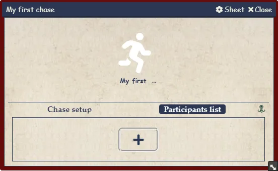

A ficha de perseguicao tem tres partes:

- Cabecalho com informacoes do local atual.
- Aba de preparacao da perseguicao.
- Lista de participantes. Esta lista nao funciona depois que a perseguicao comeca.

# Adicionando participantes

Clique no sinal de mais da lista ou arraste um ator/token. Nao e obrigatorio haver um ator associado, o que permite criar participantes rapidamente.

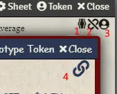

Os icones indicam:

1. Ator sintetico, uma instancia de outro ator.
2. Dados do ator nao vinculados.
3. Token associado. Voce pode arrastar para um local da perseguicao ou para a lista de participantes.
4. Dados vinculados a um ator no Diretorio de Atores.

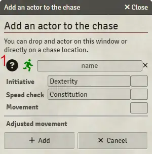

Arrastar o ponto de interrogacao para um token usa os dados desse token.

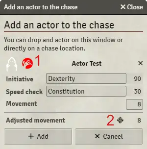

1. Alterna o lado do participante entre presa e perseguidor.
2. Faz o teste de velocidade sem exigir entrada do jogador nem criar carta de rolagem.

# Lista de participantes

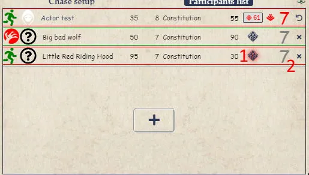

1. Faz uma rolagem de perseguicao. Se houver ator associado, cria carta no chat. Segure Shift para resolver rapidamente.
2. Limpa a rolagem de velocidade ou remove o participante.

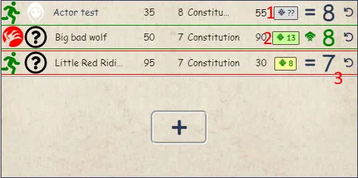

1. Carta aguardando resolucao no chat.
2. Teste de velocidade ja rolado. Clique para ver detalhes.
3. Redefine o teste de velocidade.

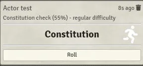

# Preparacao da perseguicao

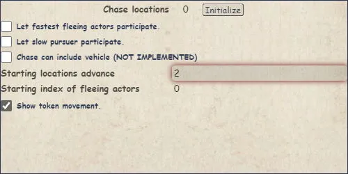

Informe o numero inicial de locais e clique em inicializar.

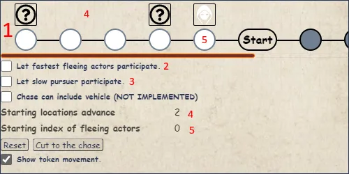

1. Trilha da perseguicao. Locais brancos sao iniciais; locais cinza sao locais reais da perseguicao.
2. Inclui participantes que poderiam escapar.
3. Inclui participantes excluidos por serem lentos demais.
4. Numero de locais entre a presa mais lenta e o perseguidor mais rapido.
5. Local inicial da presa mais rapida.
6. Anima tokens quando eles se movem.

# Configurando locais

Durante a preparacao ou a perseguicao, clique em um local para modifica-lo.

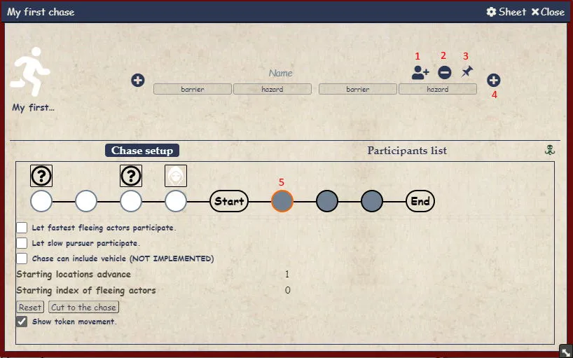

1. Adiciona participante.
2. Remove o local, se estiver vazio.
3. Arraste para uma cena para definir coordenadas. Um pino vermelho indica coordenadas definidas. Clique direito para limpar.
4. Adiciona novo local.
5. Local ativo.

# Configurando obstaculos

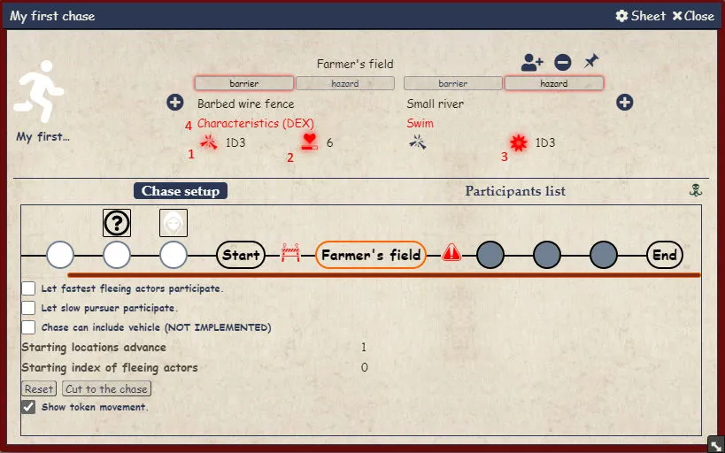

1. Adiciona dano a uma barreira.
2. Pontos de vida da barreira.
3. Custo de acao de movimento em caso de falha.
4. Teste usado para passar pelo local. Vermelho indica que o ator ativo nao tem o teste associado.

# Comecando a perseguicao

Quando estiver pronto, clique para iniciar. Se nem todos tiverem teste de velocidade, o sistema avisa e nao inicia.

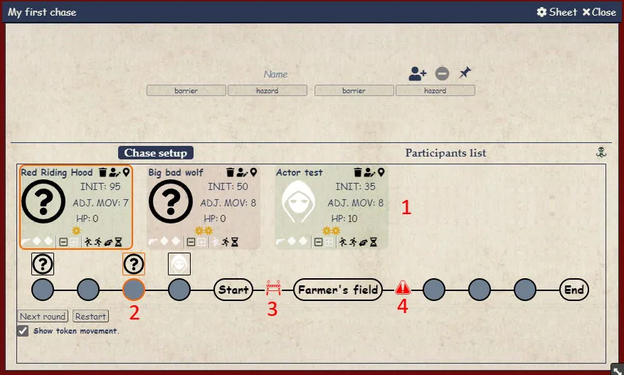

1. Trilha de iniciativa. O participante ativo fica circulado em laranja.
2. Trilha da perseguicao. Voce pode arrastar participantes livremente.
3. Barreira.
4. Perigo.

# Fluxo de resolucao de obstaculo

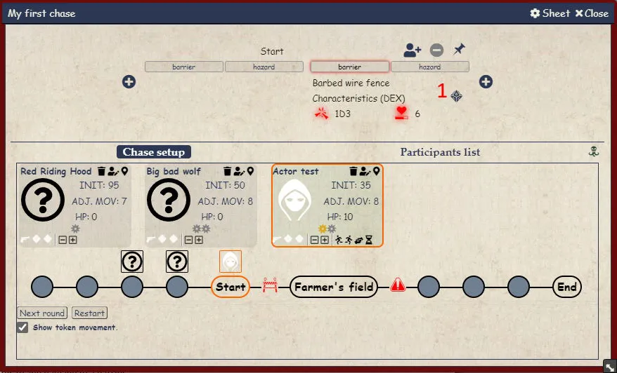

Clique no controle do obstaculo para abrir uma carta de chat onde Guardiao e jogador interagem para resolver a passagem.

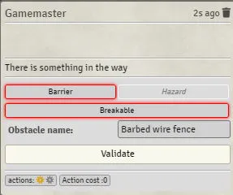
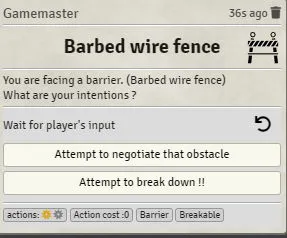
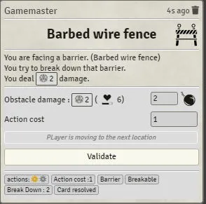
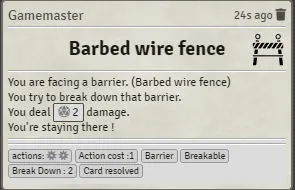

Quando o fluxo termina, as alteracoes sao enviadas para a perseguicao.

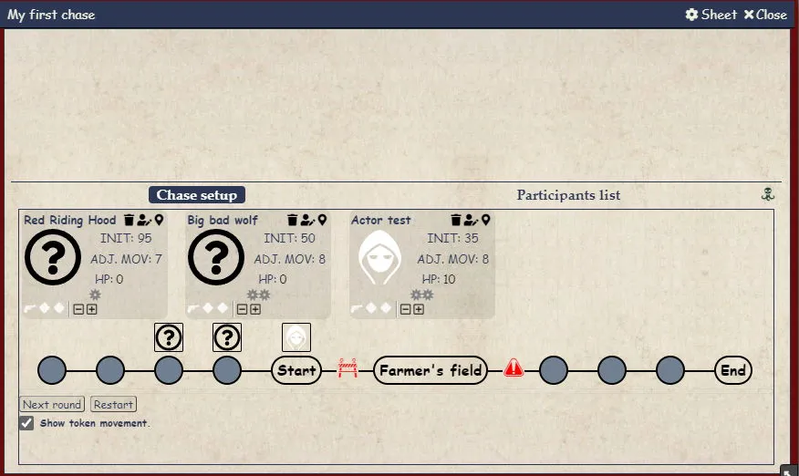

A rodada termina quando todos os atores gastam suas acoes de movimento. Clique em Proxima rodada para continuar.

# Controles do participante

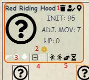

1. Excluir, modificar e ativar participante.
2. Acao de movimento: amarelo disponivel, cinza consumida, vermelho deficit.
3. Bonus do participante, como sacar arma ou receber dados de bonus.
4. Aumenta ou diminui acoes de movimento.
5. Move para frente ou para tras, auxilia aliado ou avanca com cautela.
