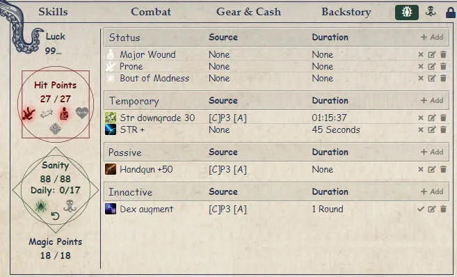
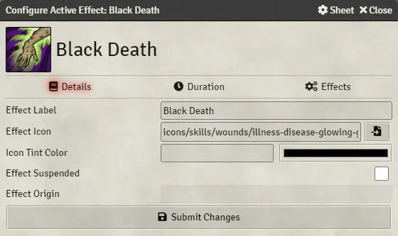
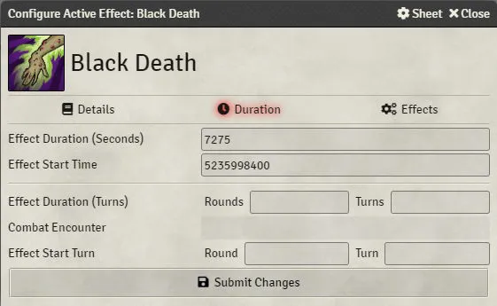
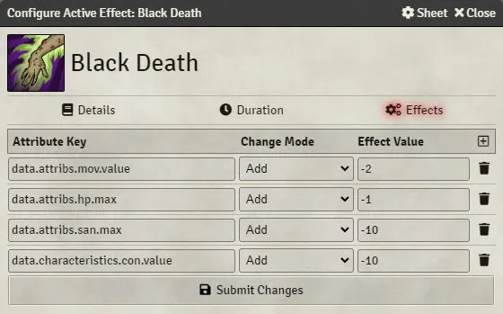

<!--- DO NOT EDIT. This file is automatically generated from coc7/manual/pt-BR/effects.md changes made to this file will be lost -->
# Efeitos

O sistema permite a criacao de Efeitos Ativos.
Um efeito ativo modifica caracteristica(s), atributo(s) ou pericia(s) de um ator.
Efeitos podem ser criados como um [link](links.md) usando a [Ferramenta de criacao de links](link_creation_window.md), ou diretamente na ficha de personagem clicando no botao .

## Aba de efeitos

Os efeitos sao exibidos na aba de efeitos da ficha de personagem.

Para PCs, os efeitos sao divididos em 4 categorias:

- Status: efeitos usados e criados pelo sistema (estado de ferimentos, caido, insano etc.). Esses efeitos nao incluem alteracoes.
- Temporario: efeitos com duracao.
- Passivo: efeitos permanentes.
- Inativo: efeitos desabilitados.

Para NPCs/Criaturas voce vera apenas 2 secoes: efeitos ativos e inativos.
Quando um efeito nao esta inativo, as alteracoes correspondentes sao aplicadas ao ator.

## Criando efeitos

Voce pode criar um efeito clicando no botao Adicionar.
Isso abrira a janela de criacao de efeito.
Essa janela possui 3 abas.

### Aba Detalhes

### Aba Duracao

### Aba Alteracoes

Essa ultima aba inclui todas as alteracoes feitas na ficha de personagem.

## Alteracoes

Um efeito possui uma lista de alteracoes. Cada alteracao precisa ser enderecada com o caminho correspondente do sistema.
As alteracoes disponiveis sao:

- Caracteristicas:
  - Forca:
    - system.characteristics.str.value
    - system.characteristics.str.bonusDice
  - Constituicao:
    - system.characteristics.con.value
    - system.characteristics.con.bonusDice
  - Tamanho:
    - system.characteristics.siz.value
    - system.characteristics.siz.bonusDice
  - Destreza:
    - system.characteristics.dex.value
    - system.characteristics.dex.bonusDice
  - Aparencia:
    - system.characteristics.app.value
    - system.characteristics.app.bonusDice
  - Inteligencia:
    - system.characteristics.int.value
    - system.characteristics.int.bonusDice
  - Poder:
    - system.characteristics.pow.value
    - system.characteristics.pow.bonusDice
  - Educacao:
    - system.characteristics.edu.value
    - system.characteristics.edu.bonusDice
- Atributos:
  - Sorte:
    - system.attribs.lck.value
    - system.attribs.lck.bonusDice
  - Sanidade:
    - system.attribs.san.value
    - system.attribs.san.bonusDice
  - Taxa de Movimento:
    - system.attribs.mov.value
  - Corpo:
    - system.attribs.build.value
  - Bonus de Dano:
    - system.attribs.db.value
  - Armadura:
    - system.attribs.armor.value
- Atributos derivados. Apenas o valor maximo desses atributos deve ser modificado. Essas alteracoes sao aplicadas depois que todas as outras alteracoes foram feitas. Se o atributo estiver em modo automatico, ele sera recalculado com as alteracoes anteriores das caracteristicas antes de ter seu valor afetado.
  - Pontos de Vida:
    - system.attribs.hp.max
  - Sanidade:
    - system.attribs.san.max
- Pericias. Pericias sao identificadas por seus nomes completos e diferenciam maiusculas de minusculas, ou pelo CoC ID
  - Charme
    - system.skills.Charm.system.value
    - system.skills.Charm.system.bonusDice
    - system.skills.i.skill.charm.system.value
    - system.skills.i.skill.charm.system.bonusDice
  - Lutar (Briga)
    - system.skills.Fighting (Brawl).system.value
    - system.skills.Fighting (Brawl).system.bonusDice
    - system.skills.i.skill.fighting-brawl.system.value
    - system.skills.i.skill.fighting-brawl.system.bonusDice
  - Todos os idiomas
    - system.skills.i.skill.language-*.system.value
    - system.skills.i.skill.language-*.system.bonusDice
- Valores de investigador
  - system.config.luckRecovery (adicionado ao final da formula de recuperacao de sorte)
  - system.config.naturalHealing (cura natural por dia)
  - system.config.idea.bonusDice
  - system.config.idea.value
  - system.config.know.bonusDice
  - system.config.know.value
